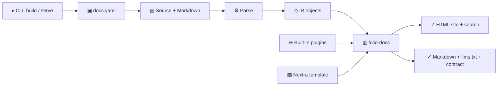

# Architecture

Folio Docs has one local build pipeline. The CLI reads configuration and parses
project sources once, then emits the human site and its agent-readable mirrors.
The pipeline runs inside the `folio` binary. Its implementation lives in the
Rust crates under `crates/`.

## Runtime Flow

1. `folio-cli` is the CLI host: it handles arguments and runs the build
   pipeline. The `folio` binary is `crates/folio-cli/src/bin/folio.rs`, a
   `main` that calls `folio_cli::run` and nothing else.
2. `folio-config` loads `docs.yaml` and resolves project paths.
3. One language crate per language profile parses the configured sources into
   `folio-ir` objects (`ModuleIR`, `ClassIR`, `FunctionIR`, `TypeIR`);
   `folio-lang-python`, `folio-lang-javascript` and `folio-lang-rust` are the
   profiles that ship today. The Python reader parses docstrings with the
   parsers in `folio-ir`: `auto`, the default, detects reStructuredText,
   Google, NumPy and epydoc per docstring, and `source.python.docstring_style`
   pins Google or NumPy.
4. `folio-docs` turns the IR into MDX pages and the API reference overview,
   and computes routes, cross-references, coverage and the `llms.txt` text.
5. `folio-mdx` reads the Markdown guides and turns them into MDX, and turns
   MDX back into the Markdown mirrors. `folio-site` owns the site workspace,
   sidebar, metadata, themes, search data, link checker and Next runtime, and
   writes the pages, mirrors and LLM files.
6. `folio-watch` watches sources and invalidates the retained build for
   `folio serve`.
7. `folio-plugins` holds the component manifest, the authoring contract and
   the built-in plugins (landing, roadmap, OpenAPI).
8. The Nextra template ships inside the binary and is materialised once under
   the user cache directory (`$XDG_CACHE_HOME/folio/template/<version>-<hash>`
   or the platform equivalent); `FOLIO_TEMPLATE_DIR` overrides it.

## Crate boundaries

`crates/*` owns the engine and the CLI host: eleven crates, one per
boundary. `folio-cli` carries the host as a
library and builds the `folio` binary from its own `src/bin/folio.rs`. The root
Cargo workspace coordinates the packages without owning an engine.

## Folio Docs internals

`folio-site` splits build-environment work into smaller steps:

- copies the bundled template from the cache directory (or `FOLIO_TEMPLATE_DIR`) into `.build/` and removes bundled demo content.
- replaces template placeholders with `docs.yaml` values.
- writes plugin components, typed data modules, and generated views.
- installs dependencies, runs Next.js, serves development mode, and copies static output.
- rewrites exported links so the static site works from `file://`.

## Reading the site as an agent

The same build emits the pages a person reads and the text an agent fetches,
from one pass over the sources:

- `llms.txt` at the site root indexes every published page and `llms-full.txt`
  carries all of them as Markdown, both following the
  [llmstxt.org](https://llmstxt.org/) spec. The `llm:` section switches them
  off ([Configuration](/docs/configuration#llm)).
- `_folio/markdown/<route>.md` mirrors each page, and every HTML page declares
  its mirror as a `text/markdown` alternate and lists it in the sitemap. Fetch
  the mirror instead of scraping the HTML.
- `_folio/contract.json` lists the core MDX components every template wires,
  with their props, the top-level `docs.yaml` keys the binary recognises, and
  every route the build emitted: the authoring surface, as the binary that wrote
  the site sees it.

Two invariants hold for anything reading or writing a Folio project. Folio
parses source and never executes it, so a package needs no install, no runtime
dependency and no import stub for its reference to build. And `folio --help`
is the authority on commands and flags, [Configuration](/docs/configuration) on
`docs.yaml` keys, and the [component catalogue](/docs/components) on
components; a flag or key that appears in neither `folio --help` nor
Configuration does not exist.

## Extension boundary

The only plugins in this release are the built-in ones.
Project plugins: Not available in this release. Plugin internals stay isolated from source parsing
and theme implementation details. A plugin contributes documents and
components to the site while inheriting every generated surface: a
contributed page also receives a Markdown mirror and appears in the configured
LLM indexes.
