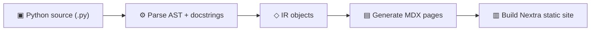

# Folio Docs

Folio Docs turns Python source and Markdown guides into a searchable static
site, API reference, and agent-readable Markdown mirrors. It is installed,
configured, and released independently from Folio for Agents.

---

## Get started in 30 seconds

```bash
uv add folio-docs
uv run folio init        # auto-detects your project
uv run folio serve       # live preview at localhost:4321
```

That's it. Folio reads your `pyproject.toml`, scans your source code, and generates a full documentation site with source pages, search, and dark mode.

---

## How it works

Folio follows a four-stage pipeline:



1. **Parse** — Reads Python source files via the `ast` module. Extracts classes, functions, type annotations, decorators, and Google-style docstrings.

2. **IR** — Converts parsed data into a clean intermediate representation (`ModuleIR`, `ClassIR`, `FunctionIR`) that captures everything needed for docs.

3. **Generate** — Transforms the IR into MDX pages with function signatures, parameter tables, class overviews, and formatted docstring content.

4. **Build** — Places MDX files into a Nextra site with shadcn/ui components. Produces a static site with search, dark mode, and responsive layout.

---

## Features

- **[Automatic API reference](/docs/docstrings)**: Point Folio at your source directories and get complete API docs — classes, methods, parameters, return types, decorators, all extracted and rendered automatically.

- **[One config file](/docs/configuration)**: A single docs.yaml of about thirty lines replaces Sphinx's conf.py, Makefile, and requirements setup.

- **[Modern UI](/docs/theming/index)**: Dark mode, full-text search, responsive layout, and shadcn/ui components out of the box. No theme hunting.

- **[Markdown + API in one site](/docs/components/index)**: Write tutorials and guides in Markdown alongside the generated API reference — everything lives in one cohesive site.

- **[Static deployment](/docs/deployment/index)**: Export plain files for GitHub Pages, Vercel, Netlify, or Docker — no custom server, no vendor in the serving path.

- **[LLM-friendly output](/docs/configuration#llm-output)**: Generates llms.txt and llms-full.txt following the llmstxt.org spec, so AI coding assistants understand your library.

- **[Plugins included](/docs/plugins/index)**: Roadmap and landing are default plugins activated by one key. OpenAPI and third-party integrations are opt-in.

- **[Sphinx migration](/docs/migration)**: A migration guide for converting existing RST pages and Sphinx conventions into Folio's Markdown and MDX inputs.

---

## Project status

Folio is under active development. The [roadmap](/roadmap) shows what's shipped
and what's in progress. Folio's operational board lives on the repository's
dedicated `board` branch and is updated there, never in code or release
branches. The [board guide](/docs/kanban) covers the card format and the
commands that move a card.

---

## Next steps

- [**Why Folio**](./why-folio) — The comparison, the honest SWOT, and the LLM-era questions
- [**Folio Docs**](./folio-docs) — The documentation generator and its code boundary
- [**Installation**](./installation) — Prerequisites and setup
- [**Quick Start**](./quickstart) — Build your first docs site step by step
- [**Architecture**](./architecture) — How the CLI, parser, generator, template, and export pipeline fit together
- [**Configuration**](./configuration) — Full `docs.yaml` reference
- [**CLI Reference**](./cli) — Every command, flag, and option
- [**Writing Docstrings**](./docstrings) — How Folio parses your code
- [**Components**](./components/index) — UI components available in your docs
- [**Theming**](./theming/index) — Customize presets, theme packages, and custom templates from one theming model
- [**Deployment**](./deployment/index) — Static hosts, GitHub Pages, CI/CD, and branch previews
- [**Plugins**](./plugins/index) — The plugin fleet and how to write your own
- [**Roadmap**](./plugins/roadmap) — Where Folio is headed, rendered live from `docs.yaml` by its own plugin
- [**Migrating from Sphinx**](./migration) — Step-by-step migration guide
