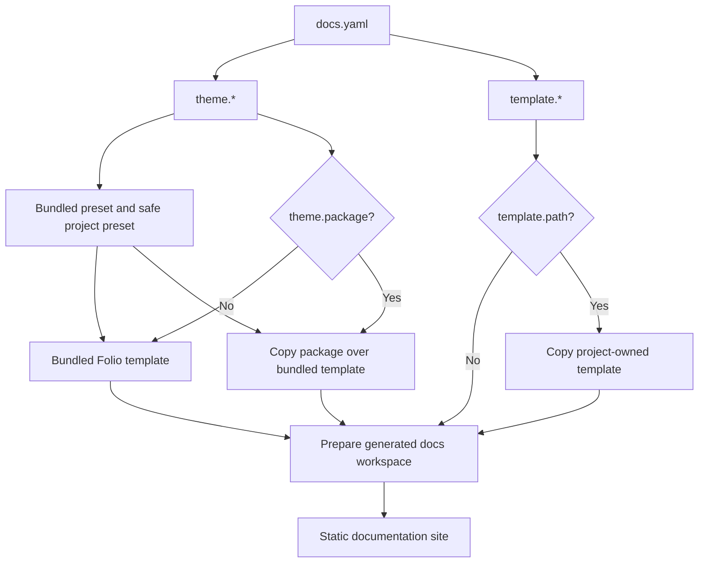

# Theming

Folio has one theming model with three ownership levels. Start with the bundled
template, move to a theme package when a project needs exact visual control, and
use a custom template only when the documentation must live inside a fully
project-owned frontend.

## Choose an Ownership Level

| Level | Configure with | Use when | Who owns the frontend |
|-------|----------------|----------|------------------------|
| Theme personalization | `theme.preset`, `theme.tune`, `theme.tokens`, `theme.header`, `theme.variants` | The bundled Folio docs shell is right, but the brand, colors, typography, spacing, or header need tuning. | Folio owns the template; your project owns safe theme data. |
| Theme package | `theme.package` | The docs should still use Folio's bundled template as a base, but a project needs to override files such as layouts, CSS, the configurator, or project theme code. | Folio owns generated content; the package overlays selected template files. |
| Custom template | `template.path` | The docs must run inside a product-specific Next/Nextra frontend with its own routes, dependencies, chrome, search UI, or application layout. | The custom template owns the frontend workspace. |

- **[Personalize a Theme](personalization)**: Set presets, defaults, tokens, variants, header actions, logo, favicon, and dark mode from docs.yaml.

- **[Build a Theme Package](theme-packages)**: Overlay files on the bundled template while Folio still injects generated content and metadata.

- **[Use a Custom Template](custom-templates)**: Bring a full Next/Nextra frontend and consume Folio's generated MDX, metadata, and component contract.

## How Folio Applies Theme Configuration

Folio always owns the generated documentation data: parsed API pages, converted
Markdown, `_meta.ts`, search metadata, LLM outputs, and static export. The
theming choice controls how much of the presentation layer your project owns.

## Recommended Path

1. Start with `theme.preset`, `theme.tune`, `logo`, and `favicon`.
2. Add project tokens, header configuration, and variants if the bundled shell is
   still the right product experience.
3. Move to `theme.package` when the project needs exact control over selected
   template files but still wants Folio's bundled template as a base.
4. Move to `template.path` when the documentation frontend is a product
   workspace, not just a styled Folio docs site.

## Related Reference

- [Configuration](../configuration) documents the complete `docs.yaml` shape.
- [ThemeConfigurator](../components/theme-configurator) documents the runtime
  drawer, built-in preset controls, and the underlying preset TypeScript
  contract.
- [Components](../components/index) lists the MDX components that generated
  docs and custom templates may need to expose.
