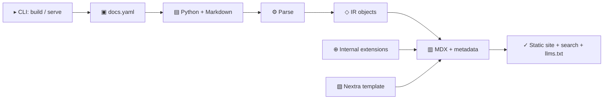

# Architecture

Folio is a local static-site generator. The CLI reads configuration, parses project sources, writes generated MDX into a Nextra workspace, then runs the Next.js static export.

## Runtime Flow

1. `folio.cli` handles command arguments and calls `folio.build.run_build`.
2. `folio.config` loads `docs.yaml` and resolved project paths.
3. `folio.sources` parses configured Python and Markdown sources.
4. `folio.build` orchestrates parsing, page generation, extension registration, link checks, dependency checks, and export.
5. `folio.generator.site_builder.SiteBuilder` owns generated content files, metadata, manifests, LLM files, and the search index.
6. `template/` provides the Nextra application that receives the generated content.

## Generator Boundaries

`SiteBuilder` delegates build-environment work to smaller modules:

- `TemplateWorkspace` copies the template and removes bundled demo content.
- `TemplateConfigInjector` replaces template placeholders with `docs.yaml` values.
- `ExtensionEmitter` writes plugin components, typed data modules, and generated views.
- `NextRuntime` installs dependencies, runs Next.js, serves development mode, and copies static output.
- `StaticAssetRewriter` rewrites exported links so the static site works from `file://`.

## Extension Boundary

Folio keeps extension internals isolated from parser, theme, and RST implementation details. The public MVP docs do not expose plugin authoring yet; release-ready hooks will be documented once that surface stabilizes.
