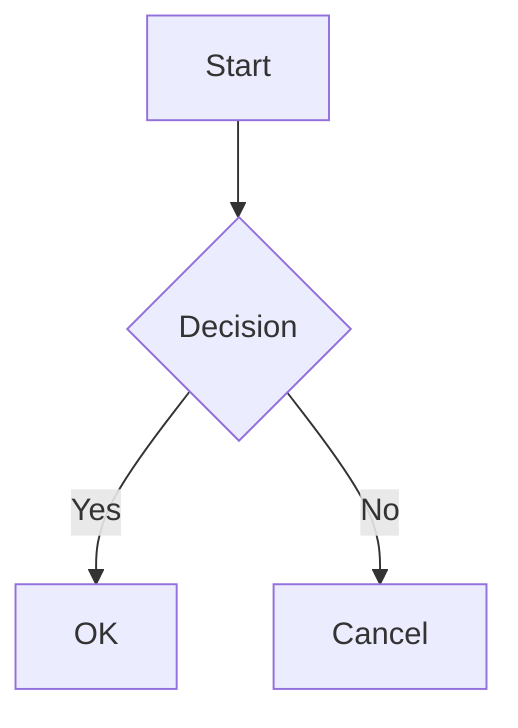
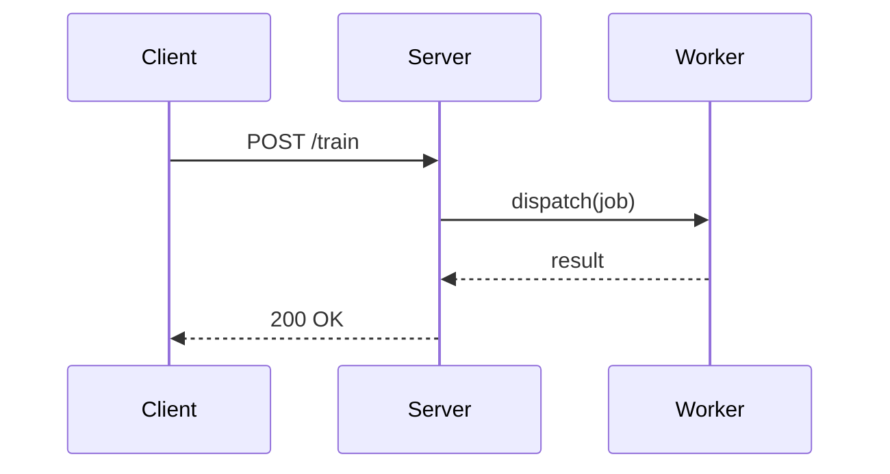
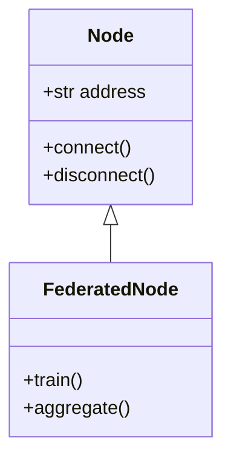

# Mermaid

Renders [Mermaid](https://mermaid.js.org/) diagrams as SVG directly in the browser. Supports flowcharts, sequence diagrams, class diagrams, state diagrams, ER diagrams, Gantt charts, and all other Mermaid diagram types. Automatically switches between light and dark themes to match the site.

## API

### Mermaid (JSX component)

| Prop | Type | Default | Description |
|------|------|---------|-------------|
| `chart` | `string` | — | The Mermaid diagram definition string. |

### Fenced code block (recommended)

You can also use standard Mermaid fenced code blocks. Folio automatically converts these into `<Mermaid>` components during the build:

````md

````

## Example

### Fenced code block syntax

<PreviewCode>

````md

````


</PreviewCode>

### JSX component syntax

<PreviewCode>

```mdx
<Mermaid chart="graph TD
    A[Start] --> B{Decision}
    B -->|Yes| C[OK]
    B -->|No| D[Cancel]" />
```

<Mermaid chart="graph TD
    A[Start] --> B{Decision}
    B -->|Yes| C[OK]
    B -->|No| D[Cancel]" />

</PreviewCode>

### Sequence diagram

<PreviewCode>

````md

````


</PreviewCode>

### Class diagram

<PreviewCode>

````md

````


</PreviewCode>
