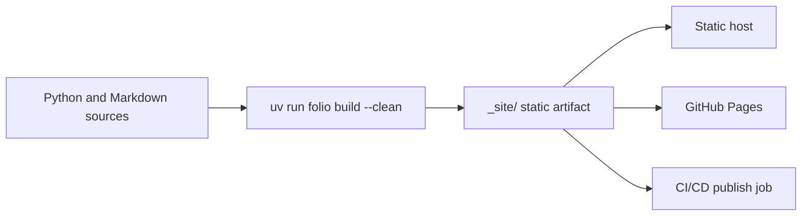

# Deployment

Folio builds a static site into `_site/`. Deploy that folder to any static host.
The internal `.build/` workspace is only a cache and should not be committed or
used as the public artifact.

Deployment has one artifact and several delivery paths:

| Path | Use when |
|------|----------|
| Static hosts | You want Vercel, Netlify, or a static web server to build or serve `_site/`. |
| GitHub Pages | You want production docs and optional PR previews hosted by GitHub Pages. |
| CI/CD | You want GitHub Actions or another pipeline to build, check, and publish docs automatically. |

<CardGrid columns={3}>
  <FeatureCard
    title="Static Hosts"
    description="Deploy _site/ to Vercel, Netlify, or a small self-hosted static server."
    href="static-hosts"
  />
  <FeatureCard
    title="GitHub Pages"
    description="Configure base paths, Pages artifacts, production deploys, and branch previews."
    href="github-pages"
  />
  <FeatureCard
    title="CI/CD"
    description="Automate deployment, branch previews, pull request checks, and coverage gates."
    href="ci-cd"
  />
</CardGrid>

## Build Once

Run the build from your project root:

```bash
uv add folio-docs
uv run folio build --clean
```

The `_site/` directory contains HTML, assets, Pagefind search data, `llms.txt`,
and `llms-full.txt`.



## Base Paths

Most hosts serve docs at the root. Use a base path when the generated site is
published under a subpath such as `/my-repo`.

Base path priority is:

1. `FOLIO_BASE_PATH` environment variable.
2. `deploy.base_path` in `docs.yaml`.
3. GitHub Pages inference when `deploy.provider: "github-pages"` or
   `FOLIO_DEPLOY_PROVIDER=github-pages` is active in GitHub Actions.
4. No base path.

`project.url` is metadata only. It feeds sitemap and canonical URLs, but it does
not control local routing or static asset paths.

## Choose a Strategy

- Use [Static Hosts](./static-hosts) for Vercel, Netlify, Docker, Caddy, Nginx,
  or any static file server.
- Use [GitHub Pages](./github-pages) when the public artifact is a GitHub Pages
  site and you need Pages-specific base path behavior.
- Use [CI/CD](./ci-cd) when deployment should happen automatically on pushes,
  releases, pull requests, or scheduled workflows.
