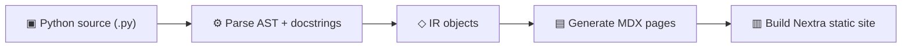

# Folio

A modern Python documentation generator that turns your source code into searchable API reference and guide pages without the complexity of Sphinx.

---

## Get started in 30 seconds

```bash
uv add folio-docs
uv run folio init        # auto-detects your project
uv run folio serve       # live preview at localhost:4321
```

That's it. Folio reads your `pyproject.toml`, scans your source code, and generates a full documentation site with API reference, search, and dark mode.

---

## How it works

Folio follows a four-stage pipeline:



1. **Parse** — Reads Python source files via the `ast` module. Extracts classes, functions, type annotations, decorators, and Google-style docstrings.

2. **IR** — Converts parsed data into a clean intermediate representation (`ModuleIR`, `ClassIR`, `FunctionIR`) that captures everything needed for docs.

3. **Generate** — Transforms the IR into MDX pages with function signatures, parameter tables, class overviews, and formatted docstring content.

4. **Build** — Places MDX files into a Nextra site with shadcn/ui components. Produces a static site with search, dark mode, and responsive layout.

---

## Features

**Automatic API reference** — Point Folio at your source directories and get complete API docs. Classes, methods, parameters, return types, decorators — all extracted and rendered automatically.

**One config file** — A single `docs.yaml` (typically under 30 lines) replaces Sphinx's `conf.py`, `Makefile`, and requirements setup.

**Modern UI** — Dark mode, full-text search, responsive layout, and shadcn/ui components out of the box. No theme hunting.

**Markdown + API in one site** — Write tutorials and guides in Markdown alongside auto-generated API reference. Everything lives in one cohesive site.

**Static deployment** — Export plain files for GitHub Pages, Vercel, Netlify, or Docker without a custom server.

**LLM-friendly output** — Generates `llms.txt` and `llms-full.txt` following the [llmstxt.org](https://llmstxt.org) spec, so AI coding assistants can understand your library.

**Sphinx migration** — Includes a migration guide and an RST-to-MDX converter for common directives. Convert existing RST pages to Markdown before adding them to `source.docs`.

---

## Comparison

<ComparisonMatrix className="mt-6" />

---

## Next steps

- [**Installation**](./installation) — Prerequisites and setup
- [**Quick Start**](./quickstart) — Build your first docs site step by step
- [**Architecture**](./architecture) — How the CLI, parser, generator, template, and export pipeline fit together
- [**Configuration**](./configuration) — Full `docs.yaml` reference
- [**CLI Reference**](./cli) — Every command, flag, and option
- [**Writing Docstrings**](./docstrings) — How Folio parses your code
- [**Components**](./components/index) — UI components available in your docs
- [**Theming**](./theming) — Customize colors, fonts, and layout
- [**Migrating from Sphinx**](./migration) — Step-by-step migration guide
