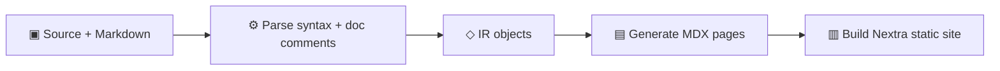

# Folio Docs

Folio Docs is one native Rust binary that turns source code and Markdown guides
into a searchable static site, API reference, and agent-readable Markdown
mirrors. It reads your source without running it, and never imports the package
it documents. Python, JavaScript, and Rust read today; see
[Languages](./languages) for what each reader covers and what arrives
next.

[Install Folio](./installation), then run, from your project root:

```bash
folio init
folio serve
```

`folio build` and `folio serve` are the commands you run most; the
[CLI Reference](./cli) covers the rest.

---

## Get started

Folio reads your project metadata, scans your source code, and generates a full documentation site with source pages, search, and dark mode. [Quick Start](./quickstart) walks the first build end to end; [Installation](./installation) covers the prerequisites and the standalone installer.

---

## How it works

Folio follows a four-stage pipeline:



1. **Parse** — Reads your source files with a native parser in the Rust core; no interpreter and no language toolchain runs. Extracts modules, functions, classes, signatures, type annotations, and doc comments. Nothing is executed.

2. **IR** — Converts parsed data into a clean intermediate representation (`ModuleIR`, `ClassIR`, `FunctionIR`, `TypeIR`) that carries the language identity and everything needed for docs.

3. **Generate** — Transforms the IR into MDX pages with function signatures, parameter tables, class overviews, and formatted docstring content.

4. **Build** — Places MDX files into a Nextra site with shadcn/ui components. Produces a static site with search, dark mode, and responsive layout.

---

## Inside the binary

The `folio` binary carries the whole pipeline:

- The site builder owns the generated content workspace and search index.
- The MDX writer, sidebar, template workspace, theme support, and Next runtime
  live beside it.
- Parsing, IR, configuration, the built-in plugins, and orchestration ship in
  the same binary.

[Architecture](./architecture) walks the crates and the runtime flow.

---

## Agent-readable output

One build writes the HTML site, the Markdown mirror of every generated page,
the LLM indexes, and the published authoring contract, from the same pass.

---

## Features

<CardGrid columns={2}>
  <FeatureCard
    title="Automatic API reference"
    description="Point Folio at your source directories and get complete API docs — modules, classes, functions, parameters, and return types, all extracted and rendered automatically."
    icon="api"
    href="/docs/docstrings"
  />
  <FeatureCard
    title="One config file"
    description="A single docs.yaml of about thirty lines replaces Sphinx's conf.py, Makefile, and requirements setup."
    icon="settings"
    href="/docs/configuration"
  />
  <FeatureCard
    title="Modern UI"
    description="Dark mode, full-text search, responsive layout, and shadcn/ui components out of the box. No theme hunting."
    icon="dashboard"
    href="/docs/theming/index"
  />
  <FeatureCard
    title="Markdown + API in one site"
    description="Write tutorials and guides in Markdown alongside the generated API reference — everything lives in one cohesive site."
    icon="book"
    href="/docs/components/index"
  />
  <FeatureCard
    title="Static deployment"
    description="Export plain files for GitHub Pages, Vercel, Netlify, or Docker — no custom server, no vendor in the serving path."
    icon="server"
    href="/docs/deployment/index"
  />
  <FeatureCard
    title="LLM-friendly output"
    description="Generates llms.txt and llms-full.txt following the llmstxt.org spec, so AI coding assistants understand your library."
    icon="ai"
    href="/docs/configuration#llm"
  />
  <FeatureCard
    title="Plugins included"
    description="Roadmap, the landing page and OpenAPI ship in the binary; each switches on with its own section in docs.yaml. Project plugins: Not available in this release."
    icon="workflow"
    href="/docs/plugins/index"
  />
  <FeatureCard
    title="Migrating from Sphinx"
    description="Move a Sphinx project's guides and API documentation to Folio, configure sources, and verify the generated site."
    icon="git"
    href="/docs/migration"
  />
</CardGrid>

---

## Project status

Folio is under active development. The [roadmap](./plugins/roadmap) is
rendered from this repository's `docs.yaml` and shows what has shipped and what
is in progress.

---

## Next steps

- [**Why Folio**](./why-folio) — The comparison, the honest SWOT, and the LLM-era questions
- [**Installation**](./installation) — Prerequisites and setup
- [**Quick Start**](./quickstart) — Build your first docs site step by step
- [**Architecture**](./architecture) — How the CLI, parser, generator, template, and export pipeline fit together
- [**Developer Guide**](./developing) — Build and test the Rust workspace from a checkout
- [**Configuration**](./configuration) — Full `docs.yaml` reference
- [**CLI Reference**](./cli) — Every command, flag, and option
- [**Languages**](./languages) — The source languages Folio reads, and the ones that arrive next
- [**Writing Doc Comments**](./docstrings) — How Folio reads Python docstrings, JSDoc and Rust doc comments
- [**API Reference**](./api-reference) — What the generated reference contains, and why this site ships without one for Folio's own code
- [**Components**](./components/index) — UI components available in your docs
- [**Theming**](./theming/index) — Customize presets, theme packages, and custom templates from one theming model
- [**Deployment**](./deployment/index) — Static hosts, GitHub Pages, CI/CD, and branch previews
- [**Plugins**](./plugins/index) — The built-in integrations and how each one activates
- [**Roadmap**](./plugins/roadmap) — Where Folio is headed, rendered live from `docs.yaml` by its own plugin
- [**Migrating from Sphinx**](./migration) — Move a Sphinx project to Folio
