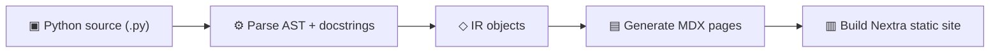

# Folio

Folio is one product family built from repository truth.

- **Folio Docs** is the documentation generator. It turns Python source and
  Markdown guides into a searchable static site, API reference, and Markdown
  mirrors.
- **Folio for Agents** is the meta-harness: a harness over harnesses that gives
  coding agents shared context, rules, board state, and durable artifacts without
  replacing the tools already in use.

---

## Get started in 30 seconds

```bash
uv add folio-docs
uv run folio init        # auto-detects your project
uv run folio serve       # live preview at localhost:4321
```

That's it. Folio reads your `pyproject.toml`, scans your source code, and generates a full documentation site with source pages, search, and dark mode.

---

## How it works

Folio follows a four-stage pipeline:



1. **Parse** — Reads Python source files via the `ast` module. Extracts classes, functions, type annotations, decorators, and Google-style docstrings.

2. **IR** — Converts parsed data into a clean intermediate representation (`ModuleIR`, `ClassIR`, `FunctionIR`) that captures everything needed for docs.

3. **Generate** — Transforms the IR into MDX pages with function signatures, parameter tables, class overviews, and formatted docstring content.

4. **Build** — Places MDX files into a Nextra site with shadcn/ui components. Produces a static site with search, dark mode, and responsive layout.

---

## Features

<CardGrid columns={2}>
  <FeatureCard
    title="Automatic API reference"
    description="Point Folio at your source directories and get complete API docs — classes, methods, parameters, return types, decorators, all extracted and rendered automatically."
    icon="api"
    href="/docs/docstrings"
  />
  <FeatureCard
    title="One config file"
    description="A single docs.yaml of about thirty lines replaces Sphinx's conf.py, Makefile, and requirements setup."
    icon="settings"
    href="/docs/configuration"
  />
  <FeatureCard
    title="Modern UI"
    description="Dark mode, full-text search, responsive layout, and shadcn/ui components out of the box. No theme hunting."
    icon="dashboard"
    href="/docs/theming/index"
  />
  <FeatureCard
    title="Markdown + API in one site"
    description="Write tutorials and guides in Markdown alongside the generated API reference — everything lives in one cohesive site."
    icon="book"
    href="/docs/components/index"
  />
  <FeatureCard
    title="Static deployment"
    description="Export plain files for GitHub Pages, Vercel, Netlify, or Docker — no custom server, no vendor in the serving path."
    icon="server"
    href="/docs/deployment/index"
  />
  <FeatureCard
    title="LLM-friendly output"
    description="Generates llms.txt and llms-full.txt following the llmstxt.org spec, so AI coding assistants understand your library."
    icon="ai"
    href="/docs/why-folio"
  />
  <FeatureCard
    title="Plugins included"
    description="Roadmap, kanban, and the landing page are default plugins activated by one key. OpenAPI is bundled and opt-in."
    icon="workflow"
    href="/docs/plugins/index"
  />
  <FeatureCard
    title="Sphinx migration"
    description="A migration guide and an RST-to-MDX converter for common directives — move existing pages without a rewrite."
    icon="git"
    href="/docs/migration"
  />
</CardGrid>

---

## Project status

Folio is under active development. The [roadmap](/roadmap) shows what's shipped
and what's in progress. The [development board](/kanban) is the actual backlog:
its columns come from YAML and every card is a Markdown file in this repository.

---

## Next steps

- [**Why Folio**](./why-folio) — The comparison, the honest SWOT, and the LLM-era questions
- [**Installation**](./installation) — Prerequisites and setup
- [**Quick Start**](./quickstart) — Build your first docs site step by step
- [**Architecture**](./architecture) — How the CLI, parser, generator, template, and export pipeline fit together
- [**Configuration**](./configuration) — Full `docs.yaml` reference
- [**CLI Reference**](./cli) — Every command, flag, and option
- [**Writing Docstrings**](./docstrings) — How Folio parses your code
- [**Components**](./components/index) — UI components available in your docs
- [**Theming**](./theming/index) — Customize presets, theme packages, and custom templates from one theming model
- [**Deployment**](./deployment/index) — Static hosts, GitHub Pages, CI/CD, and branch previews
- [**Plugins**](./plugins/index) — The plugin fleet and how to write your own
- [**Roadmap**](./plugins/roadmap) — Where Folio is headed, rendered live from `docs.yaml` by its own plugin
- [**Kanban**](./kanban) — The development board: git-persisted, drag-and-drop, exports move commands
- [**Migrating from Sphinx**](./migration) — Step-by-step migration guide
