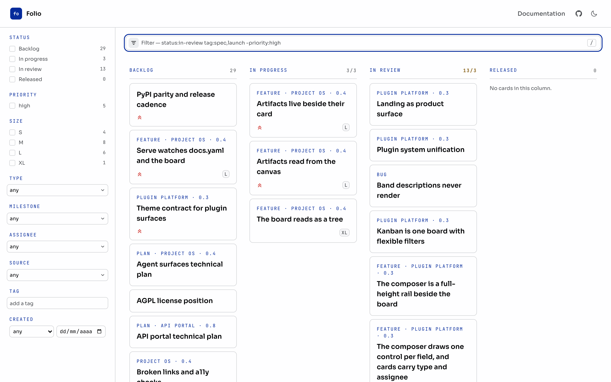

# Kanban

The kanban board is a plugin that ships with Folio: the official
`folio.plugins.kanban` plugin renders a git-persisted board from source
configuration, with drag-and-drop editing in the browser.
This page shows the board; [Start a board](/docs/kanban/start/) gets
you your own. The card schema lives in [Board formats](./formats), every
command in the [Kanban CLI](./cli), and the operating protocol in
[Operating a board](./agents); those pages are the full contract an agent
needs to operate a board without reading the plugin source. What deliberately
does not exist yet is listed at the end.

**[Open the living board](/kanban/)** — the standalone page this site
publishes from its own `board/` directory, at the last build.

The kanban plugin ships with Folio as a first-party default plugin: it is loaded on every build, with no `plugins:` entry and no environment variable required. It stays inert until a `kanban:` section appears in `docs.yaml`, and that config key is the activation switch.

This is Folio's own development board: a cardfile board in this repository's
`board/` directory, operated by the `folio kanban` CLI. It is not a screenshot
but the same component the `/kanban` page uses, reading the same files, so it
cannot drift from what the plugin does. The code tab shows the wiring.

<PreviewCode title="Folio's development board" defaultMode="preview">

```yaml
# docs.yaml
kanban:
  routes:
    docs: false        # this guide page owns the docs demo
    public: true       # standalone /kanban; a path (or "/") moves it
  source: board        # board/board.yaml + board/cards/*.md + board/SKILL.md
```

<KanbanBoard compact maxCardsPerColumn={3} />

</PreviewCode>

**[Start your own board](/docs/kanban/start/)** — five commands.

Git stays the source of truth, and the browser is a working surface on top of
it. Nothing here writes a card file: the board captures intent and hands you
the commands.

## What you get

### The card


A card carries its title and the roadmap step its milestone names.
Everything else opens in a dialog on click, ending in a band of artifacts,
the way a mail carries its attachments.

- The **Card** field is the file's path, `board/cards/<id>.md`, as text: a
  card is a file, and the path is where you open it.
- Description, criteria, comments and trail render as markdown: inline code,
  bold, http(s) links, blank lines splitting description paragraphs. Anything
  else stays literal, never raw HTML.
- A card's `## Comments` draw as a band above the artifacts.
  `folio kanban comment <id> "text"` appends to it.
- Each artifact is a tile: kind icon, label, full target in mono.
- A published target opens in a new tab: a `url:`, a compiled page, or a raw
  file the card owns. Every other tile is text.
- On a live board the band teaches the gesture:
  `folio kanban attach <id> --doc <path>`.
- Focus stays inside the dialog, `Esc` closes it, and the board stays one
  instance: no per-card navigation to get lost in.
- Milestone `0.4` resolves at build time to the phase that claims it, linking
  to its anchor when the roadmap is public; unclaimed, it renders bare.

Folio's own board does this. The card
[artifacts-read-from-the-canvas](/docs/kanban/cards/artifacts-read-from-the-canvas/)
keeps a directory beside its file, and this build published it:

- [Prototype brief](/docs/kanban/cards/artifacts-read-from-the-canvas/brief/): the
  problem that session had to answer, and the rules its prototypes had to meet.
- [Four prototypes compared](/docs/kanban/cards/artifacts-read-from-the-canvas/canvas-reading-compared/):
  what each one is bad at, and which one the comparison recommends.
- [Reading overlay](https://pguijas.github.io/folio/_folio/kanban/artifacts-read-from-the-canvas/reading-overlay.html):
  one of those four, a raw HTML file served straight from the card's directory.

The convention behind it is [What a session leaves
behind](./agents#what-a-session-leaves-behind).

### Moving a card

<Callout type="warning" title="Staged moves stay in your browser">
  A staged move lives in this browser's storage: it is not on the board
  anyone else opens, not in the repository, and not a record — the export
  is. A move stays staged only while the committed board still has the card
  where the move started. The direction is a deployment that accepts a
  change and applies it as a commit ([roadmap 0.4](/roadmap)); until then,
  export a drag in the same sitting rather than leaving it staged.
</Callout>

- **Drag it between columns**, or open the card and set its **Move to** field.
  A dashed placeholder marks where a drag lands.
- A move appends to the end of the target column: intra-column order is
  derived at build time and has no write-back.
- Drag-and-drop never fires on touch, so a touch move uses the dialog's
  **Move to** field, a dropdown whose rows carry each column's count
  against its WIP limit (the per-column cap in `board.yaml`).
- **Reset to source** discards the staged moves.
- **Export moves** copies your changes as `folio kanban move` commands,
  downloading them instead when the clipboard is unavailable.

### Filtering

One board, narrowed in place: a filter never produces a second board. The
filter is an expression, and the field's value is the whole of it. Press `/`
to focus it, even before you click into the page.

Five rules, and that is the language:

| You type | It means |
|---|---|
| `tag:spec priority:high` | a space means **and** |
| `tag:spec,launch` | a comma means **or** |
| `-tag:spec` | a minus **excludes** |
| `tag:"core"` | quotes are **exact**: `core`, not `core-languages` |
| `milestone:none` | `none` and `any` ask whether a field is set |

Most field names are the card's frontmatter keys; `tag`, `artifact` and
`id` are spelled for filtering, not storage. The CLI takes the same words.

| Field | Matches | Notes |
|---|---|---|
| `status` | the column the card is in | spelled the way `folio kanban move` spells it |
| `milestone` | the card's `milestone` | |
| `priority` | the card's `priority` | |
| `size` | the card's `size` | |
| `type` | the card's `type` | |
| `source` | the card's `source` | |
| `parent` | the card's `parent` | |
| `assignee` | the card's assignees | a card with two assignees matches and counts for both |
| `blocked_by` | the ids the card is blocked by | any one of them matches |
| `created` | the card's `created` date | also takes `>`, `<`, `>=` and `<=` before an ISO date |
| `tag` | the card's `tags` list | |
| `artifact` | the card's `artifacts` list | |
| `id` | the card's filename | |
| anything else | title, description and id, as text | `owner:pedro` searches for the literal string rather than failing |

A half-typed term is dropped, not applied, so the board never blinks empty
and nothing you type is an error. When a filter matches nothing, it names the
terms that empty it.

| You type | The board says |
|---|---|
| `tag:spec priority:nope` | `priority:nope` is the term that empties it, and `tag:spec` is left alone |
| `tagg:spec` | `tagg` looks like a field and is not one, so the whole word was searched as text; a deliberate search and a typo are indistinguishable until the board comes back empty |
| `tag:spec priority:high`, each matching alone | only the combination fails, rather than listing terms that are all fine |

Every filter lands in the URL as `?q=`, a shareable link, and `?milestone=`,
`?tag=`, `?priority=` and `?assignee=` still work: the roadmap deep-links a
phase with `?milestone=`. Cards are addressed by id, not position, so a
filtered board stays operable.



The mark at the head of the field opens a composer showing every value this
board has, with the count each press would give. It starts closed; Escape
closes it; narrow screens get a drawer.

- Status, priority and size are tri-state checkbox lists: included, excluded,
  off. Size lists its values in scale order, `S` before `XL`.
- Type, milestone, assignee and source are comboboxes: the list opens on the
  field's value, `any` clears it, and picking a value replaces it.
  Eight or more values grow a search box that ignores case; Escape closes the
  list, not the rail.
- Tag is a text input suggesting the board's tags; a suggestion or Enter ORs
  one in as a removable chip with its count.
- Created keeps a comparator and a date control.
- Terms no control can draw become removable chips, never rewritten: OR lists
  in single-value fields, negations, unknown fields, free text. The panel
  holds no state of its own: type by hand and the panel catches up; press a
  value and the text you typed survives.
- Counts are of the query you would get, not the value alone: pressing
  another checkbox or tag ORs into what the field holds.

### Theming

Every structural node carries a `data-slot` attribute; the full slot table is on the [component page](../components/kanban-board).

The board page renders on pure white in light mode. A tool surface reads
cleaner without the paper tint the reading surfaces carry; dark mode and every
preset keep their own background.

## What exists today

Everything documented in these pages exists and is tested. Some things
deliberately do not exist yet:

- **No board that accepts writes.** Dragging stages a move in the visitor's browser and exports commands; a deployment that accepts a change and applies it as a commit is [roadmap 0.4](/roadmap).
- **No orchestration policy.** Nothing defines how an agent picks its next card, how a card is claimed (`assignee` is a plain field with no claim semantics), or how an epic breaks down into child cards (`parent` is a validated pointer, not a workflow). The direction is [roadmap 0.4](/roadmap); the working notes live on the board.
- **No skill registration.** `board/SKILL.md` carries a skill preamble, and Folio registers it with nothing: there is no runtime it calls. The three ways an agent reaches the protocol anyway are in [How an agent finds this](./agents#how-an-agent-finds-this).
- **No prose editing via CLI.** Descriptions, acceptance-criteria checkboxes, `tags` and `blocked_by` lists, and removing artifacts or trail lines are hand edits.
- **`api:` artifacts are not validated** beyond being a non-empty string.

## Where to go next

- **[Start a board](/docs/kanban/start/)** — `folio kanban init`, the
  `board` branch, and publishing the result as a static site.
- **[Board formats](./formats)** — the cardfile format and the complete card schema.
- **[Kanban CLI](./cli)** — every `folio kanban` command, what it writes,
  and the commit it makes.
- **[Operating a board](./agents)** — the session protocol and the design
  invariants: the contract an agent follows to move a board without breaking
  it.

If you are wiring this into someone else's project, the
[plugin authoring guide](../plugins/authoring) covers the hooks the board uses.
