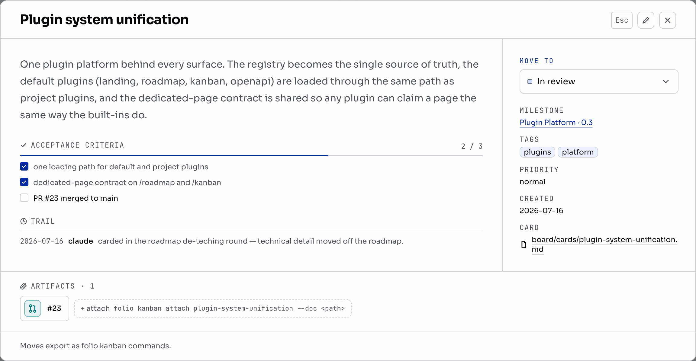

# Board

The Folio for Agents board is repository state, not a hosted service. Its
columns live in `board/board.yaml`; every card is a Markdown file under
`board/cards/`; `agents.yaml` tells the CLI where to find it.

The same files are readable by people, coding agents, shell tools, and code
review. No server, account, Node.js runtime, or Folio Docs installation is
required.

## What the board owns

- Stable card ids derived from filenames.
- Status, priority, parent and blocker topology.
- Acceptance criteria, comments, session trails, and attached artifacts.
- WIP warnings and deterministic ordering.
- Narrow edits and optional `board:` commits through `folio board`.
- An in-repository `SKILL.md` describing how agents should operate it.

[Start a board](./start/) takes a few commands. [Board formats](./formats)
defines the file contract, [CLI reference](./cli) covers every operation, and
[Operating a board](./agents) defines the session protocol.

## What it deliberately does not own

Folio for Agents does not choose an agent, claim work automatically, execute
tasks, or push changes. It is a meta-harness over the coding harnesses already
in the repository: shared context and work state without replacing them.

It also does not require a visual UI. The optional Folio Docs adapter can
publish the files as a browser canvas with filtering, progressive card and
artifact reading, and staged drag-and-drop. That adapter is installed
explicitly through `docs.yaml`; installing Agents itself only adds its commands
to the shared CLI.

The canvas never becomes the source of truth. A staged move is exported as a
`folio board move` command, reviewed, and committed to the board branch.

### The card

On the public canvas, clicking a card extends one continuous workspace:
filters, canvas, card, then artifact. Later context opens farther right when
space permits and continues below otherwise. Hairline separators resize each
surface by pointer or keyboard, `Esc` unwinds one level, and the URL restores
the selected card and artifact. Readable artifacts can use native full screen.
Docs embeds keep the modal treatment. The permanent id remains the Markdown
filename, not its screen position.

### Filtering

The canvas accepts one shareable `?q=` expression. Spaces mean AND, commas mean
OR, and a leading minus excludes a term. Fields such as `status`, `priority`,
`tag`, `milestone`, and `assignee` narrow the same board without creating a
second source of truth.

### Moving a card

Drag a card or choose a destination in its dialog. The move stays in local
browser storage until **Export moves** produces the corresponding
`folio board move` commands. **Reset to source** discards staged moves.
