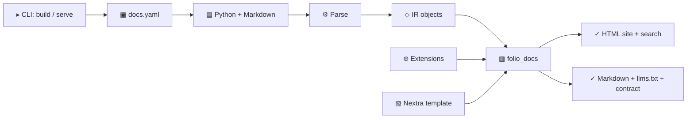

# Architecture

Folio Docs has one local build pipeline. The CLI reads configuration and parses
project sources once, then emits the human site and its agent-readable mirrors.

## Runtime Flow

1. `folio_docs.cli` handles command arguments and calls `folio_docs.build.run_build`.
2. `folio_docs.config` loads `docs.yaml` and resolved project paths.
3. `folio_docs.sources` parses configured Python and Markdown sources.
4. `folio_docs.build` orchestrates extensions, validation, and export.
5. `folio_docs.docs.site_builder.SiteBuilder` owns the human site workspace, pages,
   metadata, themes, runtime, and search index.
6. `folio_docs.agent_output.AgentArtifacts` owns Markdown mirrors, LLM files,
   robots discovery, and the published authoring contract.
7. `template/` provides the Nextra application.

## Product boundaries

Folio Docs does not import `folio_agents`. The optional board publishing plugin
lives in Folio for Agents and depends on the public Docs plugin surface. The
core Docs build remains usable when that package is absent.

## Folio Docs internals

`SiteBuilder` delegates build-environment work to smaller modules:

- `TemplateWorkspace` copies the template and removes bundled demo content.
- `TemplateConfigInjector` replaces template placeholders with `docs.yaml` values.
- `ExtensionEmitter` writes plugin components, typed data modules, and generated views.
- `NextRuntime` installs dependencies, runs Next.js, serves development mode, and copies static output.
- `StaticAssetRewriter` rewrites exported links so the static site works from `file://`.

## Extension boundary

Folio keeps extension internals isolated from source parsing and theme
implementation details. Plugins can contribute documents and components to the
site while inheriting both product outputs: a contributed page also receives a
Markdown mirror and appears in the configured LLM indexes.
